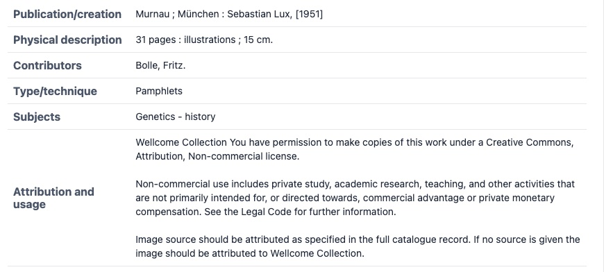

# React IIIF Vault
This library is a fully featured IIIF Library for reading and displaying IIIF Manifests, Collections and Annotations.

It is built on `@iiif/helpers` ([Repository](https://github.com/IIIF-Commons/iiif-helpers)) and uses the IIIF Vault to
request, parse, upgrade and store IIIF. It also contains the React implementation of [Canvas Panel](https://github.com/digirati-co-uk/iiif-canvas-panel) which is built on [Atlas Viewer](https://github.com/atlas-viewer/atlas).

```
npm i react-iiif-vault
```

It is recommended to install the helpers too, and the TypeScript types for IIIF, if you are using TypeScript.
```
npm i @iiif/helpers @iiif/presentation-3
```

## Canvas Panel

The easiest way to get a simple headless and extensible viewer is to use the Canvas Panel component. You can
use it as a single component, or you can build your own Viewer from it's part, deciding which types of Content you want to support (images, video, audio, 3D, HTML etc.).

```tsx
import { CanvasPanel } from 'react-iiif-vault';

function MyViewer() {
  return <CanvasPanel manifest="https://digirati-co-uk.github.io/wunder.json" />
}
```

There are a lot of options you can pass to Canvas Panel to customise the way it renders IIIF and also
slots for inserting UI that will have access to the [Contexts](https://react.dev/learn/passing-data-deeply-with-context) provided by the library.


For example, you can use the `useSimpleViewer()` hook to gain access to controls for moving forward and back and
also the `useManifest` or other resource hooks to get access to the IIIF.

```tsx
import { CanvasPanel, useSimpleViewer, useManifest, LocaleString } from 'react-iiif-vault';

function MyViewer() {
  return (
    <CanvasPanel 
      header={<Label />}
      manifest="https://digirati-co-uk.github.io/wunder.json" 
    >
      <MyControls />
    </CanvasPanel>
  );
}

function MyControls() {
  const { previousCanvas, nextCanvas } = useSimpleViewer();
  return (
    <div>
      <button onClick={previousCanvas}>Prev</button>
      <button onClick={nextCanvas}>Next</button>
    </div>
  );
}

function Label() {
  const manifest = useManifest();

  if (!manifest) {
    return <div>Loading..</div>;
  }

  return (
    <LocaleString as="h2" className="text-2xl my-3">
      {manifest.label}
    </LocaleString>
  );
}
```

The `useSimpleViewer()` hook returns the following:
```ts
type SimpleViewerContext = {
  items: Reference<'Canvas'>[];
  sequence: number[][];
  hasNext: boolean;
  hasPrevious: boolean;
  setSequenceIndex: (newId: number) => void;
  setCurrentCanvasId: (newId: string) => void;
  setCurrentCanvasIndex: (newId: number) => void;
  currentSequenceIndex: number;
  nextCanvas: () => void;
  previousCanvas: () => void;
};
```

For paged items, `sequence` will be a list of indices into `items`. For example:
```ts
const sequence = [
  [0],
  [1, 2],
  [3, 4]
];

const items = [
  {/* front page */},
  {/* page 1v */},
  {/* page 1r */},
  {/* page 2v */},
  {/* page 2r */},
];
```

You can create a list of the sequence, grouped by "row" with a simple map:
```ts
const itemSequence = sequence.map(row => row.map(idx => items[idx]));
// [
//   [ {/* front page */} ],
//   [ {/* page 1v */}, {/* page 1r */} ]
//   [ {/* page 2v */}, {/* page 2r */} ]
// ]
```

The sequence is pre-generated, so paging forward and back is as simple as going to the next index in the sequence.
The items returned will be all the IIIF Canvases that should be rendered.

For continuous Manifests (e.g. a long Scroll), there will only be one item in the sequence:
```ts
const sequence = [
  [0, 1, 2, 3, 4 ...],
]
```
Indicating that all the canvases should be displayed in a single view.

You can disable paging by passing `pagingEnabled={false}` to `<CanvasPanel />`.

You can grab the [React ref](https://react.dev/learn/referencing-values-with-refs) from the `<CanvasPanel />` component to control it from outside of the component.

Example:
```tsx
function MyViewer() {
  const ref = useRef();


  return <>
    <CanvasPanel ref={ref} manifest={...} />
    <div>
      <button onClick={() => ref.current.previousCanvas()}>Prev</button>
      <button onClick={() => ref.current.nextCanvas()}>Next</button>
    </div>
  </>;
}
```

The ref is the same as what is returned from `useSimpleViewer()`.

## Simple Viewer Provider

One of the main components of this Library is the `<SimpleViewerProvider />`. This is a component you can
wrap around other IIIF components to load a IIIF Manifest and enable all the other hooks and components.

It takes the following properties:
```
manifest: string;
pagingEnabled?: boolean;
startCanvas?: string;
rangeId?: string;
```

Example:
```tsx
import { SimpleViewerProvider, useManifest, LocaleString } from 'react-iiif-vault';

function MyViewer() {
  return (
    <SimpleViewerProvider manifest="https://digirati-co-uk.github.io/wunder.json">
      <ManifestTitle />
    </SimpleViewerProvider>
  );
}


function ManifestTitle() {
  const manifest = useManifest();

  return <LocaleString as="h1">{manifest.label}</LocaleString>
}
```
Will display:

> # Wunder der Vererbung / von Fritz Bolle.

Components inside this context can also use the `useSimpleViewer()` hook, similar to Canvas Panel.

## Vault provider

If you want to use the context manually, and not build a viewer specifically, you can wrap your application in a `VaultProvider`, passing a custom Vault instance if you want (This can be useful for server side rendering).

```tsx
function MyApp() {
  return (
    <VaultProvider>
      <App />
    </VaultProvider>
  );
}
```

From anywhere in your app, you will be able to access the Vault using:
```ts
const vault = useVault();
```

#### Example NextJS hydration of IIIF Manifest
For server side rendering, you can pass IIIF resources into Vault. You will need a client component
that wraps other components. Only client components can use the hooks, since they depend on the provider.
```tsx
// ManifestLoader.tsx
"use client";
import { SimpleViewerProvider, VaultProvider } from "react-iiif-vault";
import { Vault } from "@iiif/helpers/vault";
import type { Manifest } from '@iiif/presentation-3';

export const vault = new Vault();

export function ManifestLoader(props: { manifest: Manifest; children: React.ReactNode }) {
  // On the client, use `vault.requestStatus()` to check if the Manifest already exists
  // if not, use `vault.loadSync()` to load it and ensure its loaded immediately from the JSON.
  if (props.manifest && props.manifest.id && !vault.requestStatus(props.manifest.id)) {
    vault.loadSync(props.manifest.id, props.manifest)
  }

  return (
    <SimpleViewerProvider manifest={props.manifest} vault={vault}>
      {props.children}
    </SimpleViewerProvider>
  );
}
```

You can then use this in a server component, passing down the Manifest JSON.
```ts
// app/page.tsx
import { readFile } from 'node:fs/promises';

export default async function Page() {
  const manifestJson = await readFile('./manifests/my-manifest.json').then(s => JSON.parse(s));

  return (
    <ManifestLoader manifest={manifestJson}>
      {/* ... Other server or client components ... */}
    </ManifestLoader>
  );
}
```

This will prevent the IIIF Resource being requested remotely, speeding up the initial rendering of pages.

## Providers + Hooks

Some hooks, like `use{RESOURCE}` require a context to be set. Some will be available from the `SimpleViewerProvider` and others may be required before using the hooks. The available providers are:
- `<AnnotationProvider annotation="..." />` - Single annotation context, enables:
  - `useAnnotation()`
  - `usePaintingAnnotation()` 
- `<AnnotationPageProvider annotationPage="..." />` - Single annotation page context, enables `useAnnotationPage()`
- `<CanvasContext canvas="..." />` - Single canvas context, enables:
  - `useThumbnail()`
  - `useCanvas()`
  - `usePaintables()`
  - `useRenderingStrategy()`
  - `useLoadImageService()`
  - `useImageTile()`
  - `useImageService()`
- `<CollectionContext collection="..." />` - Single collection context, enables `useCollection()`
- `<ManifestContext manifest="..." />` - Single manifest context, enables:
  - `useManifest()`
  - `useThumbnail()`
  - `useSearchService()`
- `<RangeContext range="..." />` - Single range context, enables `useRange()`

## Components

Included are a few components that can be used within a Canvas Panel, Simple Viewer or Manifest provider.

### Image
This is a component that can render an Image from an image service or image service ID.
```tsx
<Image
  size={{ width: 256 }}
  src="https://iiif.io/api/image/3.0/example/reference/918ecd18c2592080851777620de9bcb5-gottingen"
/>
```
It supports:
- `rotation`
- `region`
- `quality`
- `size`
- `format`

You can also pass `fetchImageService={true}` to enable it to fetch the image service. This can be useful if
you want some validation on the generated URLs (e.g. level0 services). In the future more validation will be
provided. You can also pass in an image service object in the `src={{ id: ..., profile: ... }}`.

If you only pass in the image service ID, then you have to ensure that you provide valid options supported
by the image service.

### Single Canvas Thumbnail

This will display a thumbnail using either a `canvasId` or the current canvas in the context.

```tsx
<SimpleViewerContext manifest="https://digirati-co-uk.github.io/wunder.json">
  <SingleCanvasThumbnail size={{ width: 128 }} />
</SimpleViewerContext>
```

It supports the following props:
```ts
interface SingleCanvasThumbnailProps {
  canvasId?: string;
  size?: Partial<SizeParameter>;
  visible?: boolean;
  alt?: string;
  dereference?: boolean;

  // Style
  figure?: boolean;
  showLabel?: boolean;
  classes?: {
    figure?: string;
    img?: string;
    label?: string;
    imageWrapper?: string;
  };

  // Slots.
  placeholder?: React.ReactNode;
  fallback?: React.ReactNode;
}
```

### Sequence thumbnails

This wraps the `SingleCanvasThumbnail` but provides a list that is lazy-loaded based on the current sequence from the Simple Viewer Context.


Example:
```tsx
<SimpleViewerContext manifest="https://digirati-co-uk.github.io/wunder.json">
  <SequenceThumbnails
    classes={{
      container: 'flex gap-1 overflow-x-auto',
      row: 'flex gap-2 border border-gray-200 flex-none p-2 m-2',
      img: 'max-h-[128px] max-w-[128px] object-contain h-full w-full',
      selected: {
        row: 'flex gap-2 border border-blue-400 flex-none p-2 m-2 bg-blue-100',
      },
    }}
    fallback={
      <div className="flex items-center justify-center w-32 h-32 bg-gray-200 text-gray-400 select-none">
        No thumb
      </div>
    }
  />
</SimpleViewerContext>
```

The available props:
```ts
interface SequenceThumbnailsProps {
  flat?: boolean;
  size?: { width: number; height?: number };
  classes?: {
    container?: string;
    row?: string;
    item?: string;

    // SingleCanvasThumbnail
    figure?: string;
    imageWrapper?: string;
    img?: string;
    label?: string;

    selected?: {
      row?: string;
      item?: string;
      figure?: string;
      img?: string;
      label?: string;
      imageWrapper?: string;
    };
  };

  figure?: boolean;
  showLabel?: boolean;
  // Slots
  fallback?: React.ReactNode;
}
```

### Metadata components

These components will display metadata for different resources:
- `ManifestMetadata` - Displays only the metadata for the current Manifest
- `CombinedMetadata` - Displays the metadata for the current Manifest, Canvas and Range - combined
- `Metadata` - Has an extra `metadata={}` property, where you can pass down your own metadata.



Example:

```tsx
<CombinedMetadata
  allowHtml={true}
  classes={{
    container: 'm-4',
    row: 'border-b border-gray-200',
    label: 'font-bold p-2 text-slate-600',
    value: 'text-sm p-2 text-slate-800',
    empty: 'text-gray-400',
  }}
/>
```

These are provided without styles, and a `classes={}` prop for adding class names. The full list of options are available here:
```ts
export interface MetadataProps {
  config?: FacetConfig[];
  metadata?: Array<{ label: InternationalString; value: InternationalString } | null>;
  labelWidth?: number;
  allowHtml?: boolean;
  showEmptyMessage?: boolean;
  separator?: string;

  classes?: {
    container?: string;
    row?: string;
    label?: string;
    value?: string;
    empty?: string;
  };

  emptyMessage?: string;
  emptyValueFallback?: string;
  emptyLabelFallback?: string;

  // Slots.
  tableHeader?: React.ReactNode;
  tableFooter?: React.ReactNode;
  emptyFallback?: React.ReactNode;
}
```

The `facetConfig` options allows you to change the way the metadata is displayed. The types are:
```ts
type FacetConfig = {
  id: string;
  label: InternationalString;
  keys: string[];
  values?: FacetConfigValue[];
};

type FacetConfigValue = {
  id: string;
  label: InternationalString;
  values: string[];
  key: string;
};
```

Example:
```ts
const facetConfig = [
  {
    id: 'topics',
    label: { en: ['Topics'] },
    keys: ['Topic', 'Subject'],
  },
  {
    id: 'collections',
    label: { en: ['Collection'] },
    keys: ['Collection'],
    values: [
      {
        id: 'featured',
        label: { en: ['Featured collection'] },
        values: ['col_00001', 'col_00002'],
      },
      {
        id: 'paintings',
        label: { en: ['Paintings'] },
        values: ['col_00003'],
      }
    ]
  }
];
```

It's unlikely that this type of configuration would be created by hand, instead a tool would be used to clean up the Metadata or curated from multiple sources. In the example above, given the following metadata input:
```json
[
  { 
    "label": {"none": ["Topic"]},
    "value": {"none": ["Some topic"]}
  },
  {
    "label": {"none": ["Subject"]},
    "value": {"none": ["Some subject", "Another subject"]}
  },
  {
    "label": {"none": ["Collection"]},
    "value": {"none": ["col_0003"]}
  },
  {
    "label": {"none": ["Object identifier"]},
    "value": {"none": ["123456"]}
  }
]
```

Would be transformed to:
```json
[
  {
    "label": {"en": ["Topics"]},
    "value": {"none": ["Some topic", "Some subject", "Another subject"]}
  },
  {
    "label": {"en": ["Collection"]},
    "value": {"en": ["Paintings"]}
  }
]
```

So the metadata that wasn't configured is skipped, values mapped and combined.